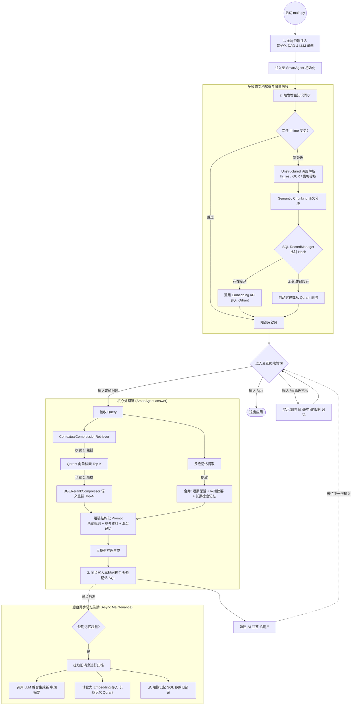

# LLM本地化及云端协同AI Agent

1.支持云端和本地部署轻量LLM大模型，提供量化、蒸馏、微调方案

2.支持mcp/skill，可扩展现有业务接口

3.支持短、中、长期记忆，可做多轮对话。

4.知识库分权分域，底层维护安全

5.借鉴开源，从0开发，高可扩展可定制

---

## 🚀 最新系统架构解析 (V2 依赖复用与全链路追踪版)

基于最新的重构进展，以下是从 0 到 1 的完整核心运行流转过程梳理：

### 1. 启动与全局初始化 (Initialization)

1. **统一入口加载**：系统经由 `src/main.py` 启动，加载日志及基础环境变量。
2. **依赖注入 (DI)**：
   - 全局仅实例化一次 `QdrantDAO` (向量数据库连接池) 和 `ChatOpenAI` (模型客户端)。
   - 以参数形式将它们注入至核心控制器 `SmartAgent` 中，彻底解决了原先重复创建网络连接的问题。
3. **性能监控启停**：因为读取了 `.env` 中 `LANGCHAIN_TRACING_V2=true` 等变量，LangSmith 将在后台静默开启，自动截获并追踪所有的模型交互与检索调用链路。

### 2. 多模态文档解析与增量同步 (Multimodal RAG Sync)

系统进入后即刻触发 `sync_knowledge_base()` 进行本地文本的加载：

1. **第一道防线 (文件系统拦截)**：在 `src/core/loader.py` 中，程序依据 `.sync_state.json` 检查各文档的 `mtime`。未被修改的文档会被直接拦截，节省本地读取及切分的 CPU 算力。
2. **多模态深度解析 (Unstructured.io)**：
   - 采用 `hi_res` 高级策略，支持 PDF、Docx、Markdown 等复杂排版文档。
   - **表格提取**：精准识别文档结构，将表格转化为 HTML 格式保留行列关系。
   - **图像与本地 OCR**：结合本地 `lang` 语言包与 Tesseract 引擎解决扫描件乱码；调用多模态大模型（如 GPT-4o-mini）自动生成图像摘要。
   - **语义化切分**：摒弃传统字数截断，使用 `chunk_by_title` 按章节标题保持段落的语义完整性。
3. **第二道防线 (块级别 Hash 同步)**：由 LangChain 内置的 `Indexing API` 协同 `SQLRecordManager` 把关。系统只针对有实质内容变更（Hash 变动）的 Chunk 发起 Embedding 调用，同时还会自动清理本地已被删除的文件对应在远端 Qdrant 中的冗余向量。

### 3. 多模态/分层记忆流转架构 (Multi-Layer Memory Flow)

每轮提问均由 `MultiLayerMemory` 提供记忆增强，保障聊天的连贯性和上下文连续性。为了不阻塞用户对话，记忆的“归档与提炼”在**后台异步线程**中静默完成：

1. **短期记忆 (SQL Layer)**：
   - 用户输入与 AI 回答会第一时间同步写入本地 SQLite 数据库。
   - 检索时只提取最近 $N$ 轮（如 3 轮）原汁原味的对话，保证极快的读取速度和精确的短期上下文。
2. **异步滚动归档 (Async Maintenance)**：
   - 当短期记忆超载（超过 $N$ 轮）时，触发后台异步清洗任务，将最旧的消息移出 SQL。
3. **中期摘要 (Summary Layer)**：
   - 后台任务调用 LLM，将移出的旧消息与原有的中期摘要进行融合，生成更加凝练的**全局上下文摘要**，持久化至 SQLite。
4. **长期向量 (Vector Layer)**：
   - 被移出的完整旧消息会被转化为 Vector Embedding，以独立 Collection (`user_memories`) 的形式打上 Session 等元数据标签存入 Qdrant 向量库。
   - 当用户提出与很久以前相关的问题时，通过 Semantic Search 唤醒这部分“尘封”的记忆参与 Prompt 组装。
   _(附：用户亦可使用如 `/m -s -d`、`/m -l` 等终端系统级指令直接透视与干预各层记忆)_

### 4. 组装式检索重排流水线 (Compression Pipeline)

1. 废除原有的手动两步走逻辑，引入 LangChain 规范下的 `ContextualCompressionRetriever`。
2. **第一阶段 (粗排 - Base Retriever)**：携带问题对 Qdrant 发起广域检索，召回 Top K 相关文档。
3. **第二阶段 (精排 - Rerank Compressor)**：将召回文档悉数输送至 `BGERerankCompressor` 包装下的交叉编码模型进行双向注意力语义打分，并依据 `RELEVANCE_THRESHOLD` (如 0.35) 进行低分过滤，精准提炼 Top N 作为最终素材。

### 5. 语言模型应答与落地 (Answer Generation)

1. **Prompt 融合**：拼接提取出的【参考资料段落】、【混合记忆模块（短/中/长）】、【系统核心法则与提示词】，整合成结构化 Prompt。
2. **链式推理**：执行 LLM Chain Invoke 调用大模型，完成问答。

---

### 🗺️ 最新逻辑架构图 (包含多模态与异步记忆机制)

