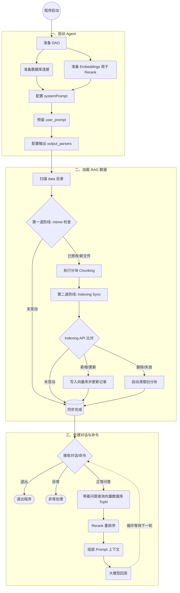

# helloAgent

1. 启动agent
   1. 准备dao
      1. 准备数据库
      2. 准备embeddings，for rerank
   2. 配置systemPrompt，预留user_prompt
   3. 输出 output_parsers
2. 加载 RAG (双重增量同步模式)
   1. **第一道防线：文件级拦截 (src/core/loader.py)**
      - 扫描 data 目录，通过 `.sync_state.json` 比对文件 `mtime`。
      - 未修改文件直接拦截，避免重复分块，显著降低本地 CPU 消耗。
   2. **第二道防线：索引级同步 (Indexing API)**
      - 初始化 `Record Manager` 持久化文档哈希与同步状态。
      - 自动处理：新增 (Added)、更新 (Updated)、跳过 (Skipped)。
      - 自动清理：清理已从磁盘删除的源文件对应的历史向量。
3. 处理对话与命令
   1. 退出
   2. 异常处理
   3. answer
      1. 带着问题查询向量数据库topN
      2. rerank
      3. 组装
      4. 回答

---

## 系统流程图

