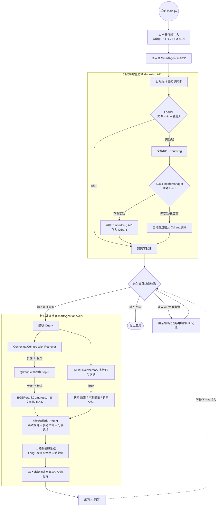

# 云端协同AI Agent

1. 支持云端和本地部署轻量LLM大模型，提供量化、蒸馏、微调方案

2. 支持mcp，可扩展现有业务接口

3. 支持短、中、长期记忆，可做多轮对话。

4. 知识库分权分域，底层维护安全

5. 从0开发，高可扩展可定制

<!-- # helloAgent

1. 启动agent
   1. 准备dao
      1. 准备数据库
      2. 准备embeddings，for rerank
   2. 配置systemPrompt，预留user_prompt
   3. 输出 output_parsers
2. 加载 RAG (双重增量同步模式)
   1. **第一道防线：文件级拦截 (src/core/loader.py)**
      - 扫描 data 目录，通过 `.sync_state.json` 比对文件 `mtime`。
      - 未修改文件直接拦截，避免重复分块，显著降低本地 CPU 消耗。
   2. **第二道防线：索引级同步 (Indexing API)**
      - 初始化 `Record Manager` 持久化文档哈希与同步状态。
      - 自动处理：新增 (Added)、更新 (Updated)、跳过 (Skipped)。
      - 自动清理：清理已从磁盘删除的源文件对应的历史向量。
3. 处理对话与命令
   1. 退出
   2. 异常处理
   3. answer
      1. 带着问题查询向量数据库topN
      2. rerank
      3. 组装
      4. 回答

---
-->

---

## 🚀 最新系统架构解析 (V2 依赖复用与全链路追踪版)

基于最新的重构进展，以下是从 0 到 1 的完整核心运行流转过程梳理：

### 1. 启动与全局初始化 (Initialization)

1. **统一入口加载**：系统经由 `src/main.py` 启动，加载日志及基础环境变量。
2. **依赖注入 (DI)**：
   - 全局仅实例化一次 `QdrantDAO` (向量数据库连接池) 和 `ChatOpenAI` (模型客户端)。
   - 以参数形式将它们注入至核心控制器 `SmartAgent` 中，彻底解决了原先重复创建网络连接的问题。
3. **性能监控启停**：因为读取了 `.env` 中 `LANGCHAIN_TRACING_V2=true` 等变量，LangSmith 将在后台静默开启，自动截获并追踪所有的模型交互与检索调用链路。

### 2. 知识库预热与增量同步 (Incremental RAG Sync)

系统进入后即刻触发 `sync_knowledge_base()` 进行本地文本的加载：

1. **第一道防线 (文件系统拦截)**：在 `src/core/loader.py` 中，程序依据 `.sync_state.json` 检查各文档的 `mtime`。未被修改的文档会被直接拦截，节省本地读取及切分的 CPU 算力。
2. **第二道防线 (块级别 Hash 同步)**：由 LangChain 内置的 `Indexing API` 协同 `SQLRecordManager` 把关。系统只针对有实质内容变更（Hash 变动）的 Chunk 发起 Embedding 调用，同时还会自动清理本地已被删除的文件对应在远端 Qdrant 中的冗余向量。

### 3. 多模态/多级记忆接入 (Multi-Layer Memory)

每轮提问均由 `MultiLayerMemory` 提供记忆增强，保障聊天的连贯性和上下文连续性：

1. **短期记忆层**：基于 SQL 数据库缓存，记录当前会话原汁原味的最近 N 轮对话历史。
2. **中期记忆层**：对过往对话内容持续进行 LLM 归纳和摘要精简。
3. **长期记忆层**：将重点历史对话向量化并留存在向量库中，利用 Semantic Search 技术在用户提问时“唤醒”遥远的深层上下文。
   _(附：用户亦可使用如 `/m -s -d`、`/m -l` 等终端系统级指令直接透视与干预各层记忆)_

### 4. 组装式检索重排流水线 (Compression Pipeline)

1. 废除原有的手动两步走逻辑，引入 LangChain 规范下的 `ContextualCompressionRetriever`。
2. **第一阶段 (粗排 - Base Retriever)**：携带问题对 Qdrant 发起广域检索，召回 Top 10 相关文档。
3. **第二阶段 (精排 - Rerank Compressor)**：将召回文档悉数输送至 `BGERerankCompressor` 包装下的交叉编码模型进行双向注意力语义打分，并依据 `RELEVANCE_THRESHOLD` (如 0.35) 进行低分过滤，精准提炼 Top 3 作为最终素材。

### 5. 语言模型应答与落地 (Answer Generation)

1. **Prompt 融合**：拼接提取出的【参考资料段落】、【分层记忆模块】、【系统核心法则与提示词】，整合成结构化 Prompt。
2. **链式推理**：执行 LLM Chain Invoke 调用大模型。
3. **回写循环**：输出内容的同时将 Human 和 AI 本轮产生的消息写回到持久化记忆系统中，等待下一轮会话。

---

### 🗺️ 最新逻辑架构图

