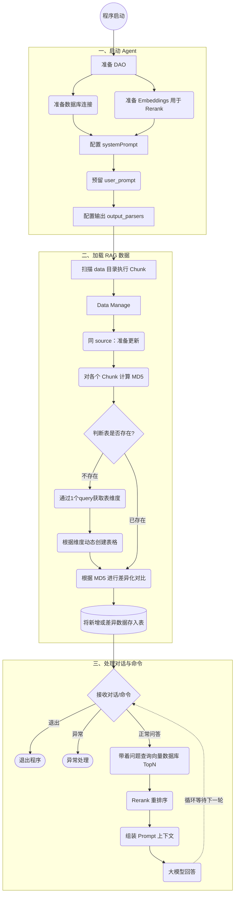

# helloAgent

1. 启动agent
   1. 准备dao
      1. 准备数据库
      2. 准备embeddings，for rerank
   2. 配置systemPrompt，预留user_prompt
   3. 输出 output_parsers
2. 加载rag
   1. data目录下chunk
   2. dataManage
      1. 同source：更新
      2. chunk做md5
      3. 如果表不存在创建表
         1. 通过1个query获取表维度
         2. 根据维度创建表格
      4. 根据md5做差异化，存入表
3. 处理对话与命令
   1. 退出
   2. 异常处理
   3. answer
      1. 带着问题查询向量数据库topN
      2. rerank
      3. 组装
      4. 回答

---

## 系统流程图

