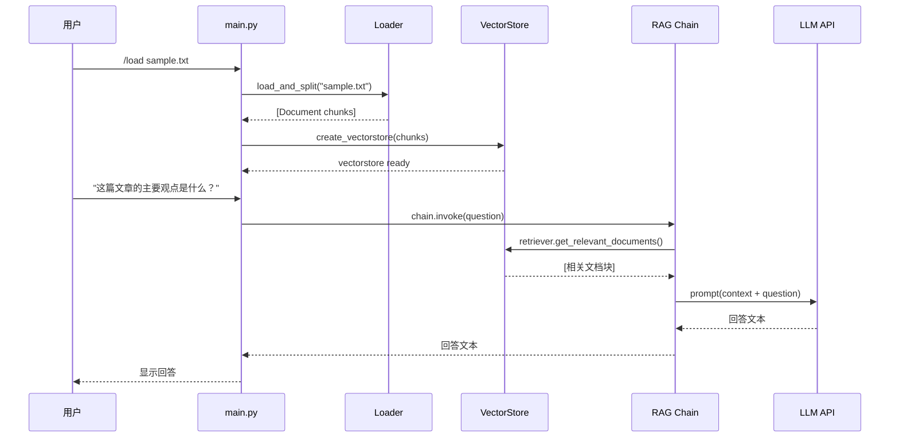

# 🏗️ Technical Design — AI Reading Notes Assistant

## 1. Architecture Overview

```
┌─────────────────────────────────────────────────────┐
│                    CLI Interface                     │
│              (main.py — 用户交互入口)                 │
└──────────────────────┬──────────────────────────────┘
                       │
        ┌──────────────┼──────────────┐
        ▼              ▼              ▼
  ┌───────────┐  ┌───────────┐  ┌───────────┐
  │  Loader   │  │    RAG    │  │ Summarizer│
  │  Module   │  │  Module   │  │  Module   │
  │ 文档加载   │  │ 检索问答   │  │ 摘要生成   │
  └─────┬─────┘  └─────┬─────┘  └─────┬─────┘
        │              │              │
        ▼              ▼              ▼
  ┌───────────┐  ┌───────────┐  ┌───────────┐
  │   Text    │  │  Qdrant   │  │    LLM    │
  │ Splitter  │  │  Vector   │  │  (OpenAI  │
  │           │  │   Store   │  │ compatible│
  └───────────┘  └───────────┘  └───────────┘
```

---

## 2. Project Structure

```
helloAgent/
├── main.py                  # 程序入口，CLI 交互循环
├── config/
│   ├── __init__.py
│   └── settings.py          # 全局配置（从 .env 加载）
├── core/                    # 核心业务逻辑
│   ├── __init__.py
│   ├── loader.py            # 文档加载与切分
│   ├── vectorstore.py       # 向量存储管理（Qdrant）
│   ├── chain.py             # LangChain 链的构建
│   └── memory.py            # 对话记忆管理
├── utils/
│   ├── __init__.py
│   └── text.py              # 通用文本处理工具
├── tools/
│   └── clearDB.py           # Qdrant 数据库清理脚本
├── docs/
│   ├── prd.md               # 产品需求文档
│   └── technical_design.md  # 本文档
├── data/                    # 存放待加载的文档
│   └── sample.txt
├── .env                     # 环境变量配置
├── .env.example             # 配置模板
└── pyproject.toml           # 项目依赖与包配置
```

---

## 3. Core Modules

### 3.1 Document Loader (`core/loader.py`)

**职责：** 加载本地文件并切分为适合检索的文本块。

**技术方案：**
- 使用 `TextLoader` 加载 `.txt` 文件
- 使用 `RecursiveCharacterTextSplitter` 切分文档
- 切分参数：`chunk_size=500`, `chunk_overlap=50`

```python
from langchain_community.document_loaders import TextLoader
from langchain_text_splitters import RecursiveCharacterTextSplitter

def load_and_split(file_path: str) -> list[Document]:
    loader = TextLoader(file_path, encoding="utf-8")
    docs = loader.load()
    splitter = RecursiveCharacterTextSplitter(
        chunk_size=500,
        chunk_overlap=50,
    )
    return splitter.split_documents(docs)
```

### 3.2 Vector Store (`core/vectorstore.py`)

**职责：** 管理文档向量的存储与检索。

**技术方案：**
- 使用 `OpenAIEmbeddings` 生成文本向量
- 使用 `QdrantVectorStore` 存储向量到本地 Qdrant 实例
- 每次加载新文档时创建/更新 collection

```python
from langchain_openai import OpenAIEmbeddings
from langchain_qdrant import QdrantVectorStore

def create_vectorstore(docs, collection_name="rag_collection"):
    embeddings = OpenAIEmbeddings(
        base_url=OPENAI_BASE_URL,
        api_key=OPENAI_API_KEY,
    )
    return QdrantVectorStore.from_documents(
        docs,
        embedding=embeddings,
        url=f"http://{QDRANT_HOST}:{QDRANT_PORT}",
        collection_name=collection_name,
    )
```

### 3.3 RAG Chain (`core/chain.py`)

**职责：** 构建检索增强生成（RAG）链，将用户问题与相关文档上下文结合后交给 LLM 回答。

**技术方案：**
- 使用 `ChatOpenAI` 作为 LLM
- 使用 `ChatPromptTemplate` 构建提示词模板
- 通过 `retriever` 从向量库检索相关文档
- 使用 LCEL（LangChain Expression Language）组装链

```python
from langchain_openai import ChatOpenAI
from langchain_core.prompts import ChatPromptTemplate
from langchain_core.runnables import RunnablePassthrough
from langchain_core.output_parsers import StrOutputParser

PROMPT_TEMPLATE = """基于以下参考资料回答问题。如果资料中没有相关信息，请如实说明。

参考资料：
{context}

问题：{question}

回答："""

def build_rag_chain(retriever):
    prompt = ChatPromptTemplate.from_template(PROMPT_TEMPLATE)
    llm = ChatOpenAI(
        base_url=OPENAI_BASE_URL,
        api_key=OPENAI_API_KEY,
    )
    return (
        {"context": retriever, "question": RunnablePassthrough()}
        | prompt
        | llm
        | StrOutputParser()
    )
```

### 3.4 Conversation Memory (`core/memory.py`)

**职责：** 管理多轮对话的历史记录，让 AI 能理解上下文。

**技术方案：**
- 使用 `ConversationBufferMemory` 存储对话历史
- 将历史记录注入到 prompt 中
- 支持清除历史（`/clear` 命令）

---

## 4. Data Flow



---

## 5. Key Technical Decisions

| 决策 | 选择 | 理由 |
|------|------|------|
| 向量数据库 | Qdrant（本地 Docker） | 用户已有 OrbStack 运行的 Qdrant 实例，数据持久化 |
| LLM 接入方式 | OpenAI 兼容接口 | 统一接口，可无缝切换 OpenAI / DeepSeek / 通义等 |
| 链构建方式 | LCEL（新语法） | LangChain 推荐方式，比旧版 Chain 类更灵活 |
| 文本切分策略 | RecursiveCharacterTextSplitter | 智能按段落/句子/字符递归切分，效果最好 |
| 配置管理 | python-dotenv + config/settings.py | 集中管理，易于切换环境 |
| 项目管理 | uv | 快速、现代的 Python 包管理工具 |

---

## 6. Dependencies

| 包 | 版本 | 用途 |
|----|------|------|
| `langchain` | ≥1.2.15 | 核心框架 |
| `langchain-openai` | ≥1.1.16 | OpenAI 兼容模型接入 |
| `langchain-community` | ≥0.4.1 | 社区文档加载器等 |
| `langchain-qdrant` | ≥1.1.0 | Qdrant 向量存储集成 |
| `langchain-text-splitters` | ≥1.1.2 | 文档切分工具 |
| `python-dotenv` | ≥1.2.2 | .env 文件加载 |

---

## 7. CLI Commands

| 命令 | 说明 |
|------|------|
| 直接输入文字 | 向 AI 提问 |
| `/load <文件路径>` | 加载文档到向量库 |
| `/summary` | 生成当前文档摘要 |
| `/clear` | 清除对话历史 |
| `/quit` | 退出程序 |
